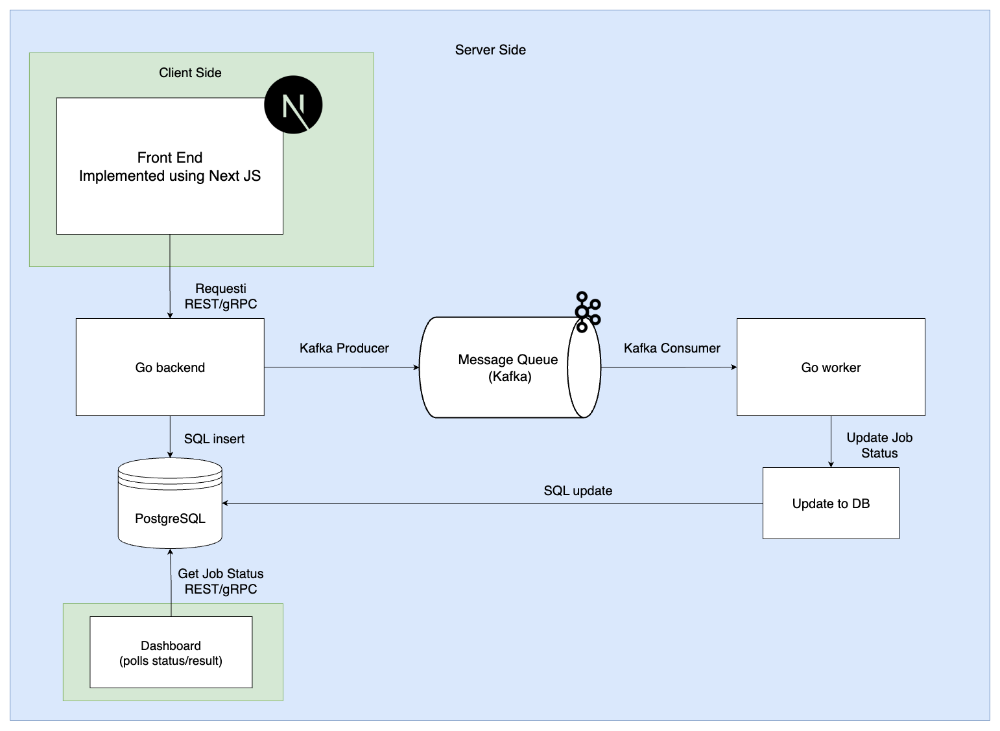

# distributed-job-queue

### ⚡️ High-Performance Distributed Job Queue System (Go + Kafka + PostgreSQL)

> **A production-grade, scalable job queue platform with real-time processing, reliable delivery, and modern cloud-native architecture.**

---

## 🚀 Overview

This project is a distributed job queue system designed to handle high-throughput, reliable background processing at scale—similar to infrastructure powering large tech companies. It leverages **Kafka** for message brokering, **Go** for concurrency, and **PostgreSQL** for persistence and analytics.

---

## 🏗️ Architecture

## Folder structure

<pre>
distributed-job-queue
  backend
    cmd
        main.go
    worker
    db
      db.go
    kafka
      comsumer/
      producer/
    proto/
  docker-compose.yml
</pre>

## Job structure

type Job struct {
    ID        int64           `json:"id"`
    Payload   json.RawMessage `json:"payload"` // could be any data (use []byte or map[string]interface{} if you want)
    Status    string          `json:"status"`  // pending, processing, success, failed
    Retries   int             `json:"retries"`
    ErrorMsg  string          `json:"error_msg,omitempty"`
    CreatedAt time.Time       `json:"created_at"`
    UpdatedAt time.Time       `json:"updated_at"`
}